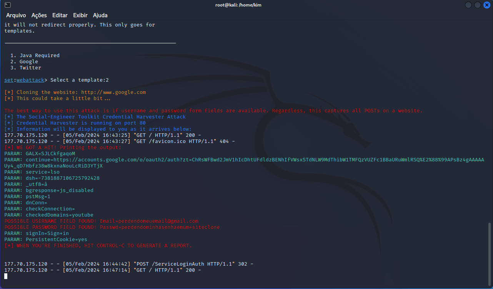

# Desafio-Phishing-no-Kali-Linux
Desafio de criação de Phishing no Kali Linux

### Ferramentas

- Kali Linux
- setoolkit

### Configurando Phishing no Linux

- Acesso root: sudo su
- Iniciando o setoolkit: setoolkit
- Tipo de ataque: Social-Engineering Attacks
- Vetor de ataque: Web Site Attack Vectors
- Método de ataque: Credential Harvester Attack Method 
- Método de ataque: Site Cloner
- Obtendo o endereço da máquina: ifconfig
- URL para clone: http://www.facebook.com

### Resultado

